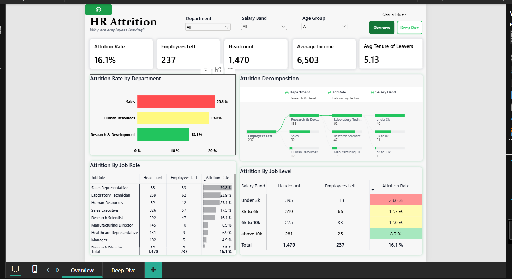
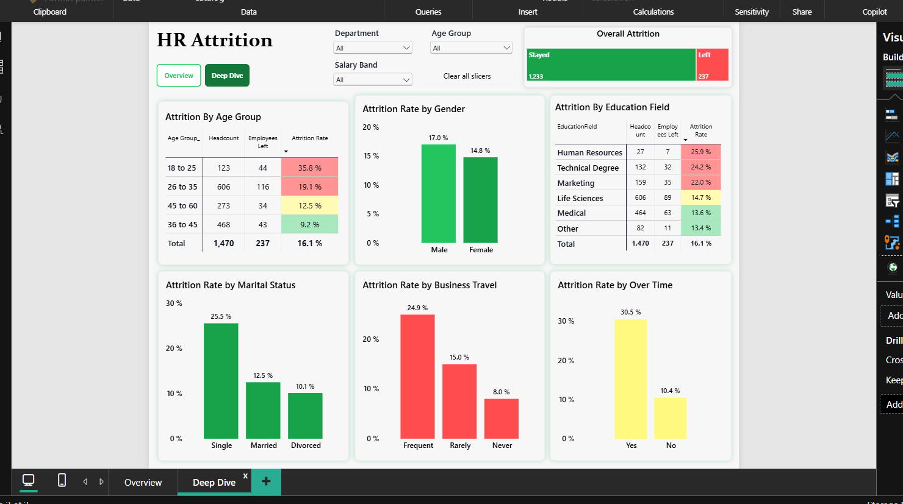

# 📊 HR Attrition Analysis

> An end-to-end HR analytics solution built in Microsoft Fabric, investigating why employees leave — from ingestion to a security-governed, interactive Power BI report.


---

## 📌 Overview

| | |
|---|---|
| **Dataset** | IBM HR Analytics Employee Attrition & Performance ([Kaggle](https://www.kaggle.com)) |
| **Records** | 1,470 employees |
| **Attrition** | 237 employees left → **16.1%** overall attrition rate |
| **Goal** | Identify where attrition risk concentrates — by department, pay, age, and work conditions |

---

## 🖼️ Dashboard Preview

| Overview | Deep Dive |
|---|---|
|  |  |

---

## 🏗️ Architecture & Implementation

- **Ingestion** — Employee records ingested via **Dataflow Gen2** into a Fabric Lakehouse
- **Transformation** — Data cleaned and shaped entirely within **Dataflow Gen2** (Power Query)
- **Modeling** — Built a **Fabric semantic model** on top of the Lakehouse, defining relationships, DAX measures, and RLS roles
- **Reporting** — Power BI report connected to the semantic model via **DirectLake** mode for near real-time performance without data duplication
- **Security** — Implemented **dynamic row-level security (RLS)** using DAX and `USERPRINCIPALNAME()`, so each department head only sees data for their own team
- **Governance** — Applied a **Confidential sensitivity label** to protect personal employee data, aligned with Fabric data governance practices

```
Dataflow Gen2 (ingest + transform) → Lakehouse → Semantic Model (DAX + RLS) → Power BI (DirectLake)
```

---

## 🔍 Key Findings

### By Department & Role
| Segment | Attrition Rate |
|---|---|
| Sales (dept.) | **20.6%** |
| HR (dept.) | 19.0% |
| R&D (dept.) | 13.8% |
| Sales Representative (role) | **39.8%** 🔺 highest risk role |

### By Pay
| Salary Band | Attrition Rate |
|---|---|
| Under 3k | **28.6%** |
| 3k–6k | 12.7% |
| 6k–10k | 12.0% |
| Above 10k | 8.9% |

### By Age & Tenure
| Age Group | Attrition Rate |
|---|---|
| 18–25 | **35.8%** |
| 26–35 | 19.1% |
| 45–60 | 12.5% |
| 36–45 | 9.2% |

Average tenure among leavers: **5.13 years** — attrition skews heavily toward early-career staff.

### By Work Conditions
| Condition | Attrition Rate |
|---|---|
| Works overtime | **30.5%** |
| No overtime | 10.4% |
| Frequent travel | **24.9%** |
| Never travels | 8.0% |

### By Demographics
| Segment | Attrition Rate |
|---|---|
| Single | **25.5%** |
| Married | 12.5% |
| Divorced | 10.1% |
| Male | 17.0% |
| Female | 14.8% |
| HR education field | **25.9%** |
| Technical Degree | 24.2% |

---

## 🧭 Dashboard Structure

- **Overview page** — headcount, attrition rate, department/role/salary breakdowns, decomposition tree
- **Deep Dive page** — age, gender, education field, marital status, business travel, and overtime cuts

---

## 🛠️ Tools Used

`Microsoft Fabric` · `Dataflow Gen2` · `Lakehouse` · `Power BI` · `DirectLake` · `DAX` · `Row-Level Security`

---

## 📁 File

- [`HR_Attrition_Dashboard.pbix`](./HR_Attrition_Dashboard.pbix) — open in Power BI Desktop to explore the full interactive report

## 🔗 Live Report

[Add your published Fabric/Power BI report link here]
